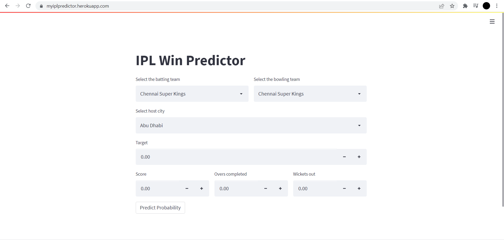

# IPLWinPredictor

IPL winner prediction, a pojects which aims to predict the winner based on features like teams, overs, wickets, current run rate, required run rate etc. Motivation behind do this was google's win probanblity notification that we got on to out Android phones. I have divided this project in four section which are listed below : <br>
- Preprocessing
- Model building
- Streamlit
- Deployment

## Preprocesssing
For this project i have used the IPL dataset available on kaggle which can be found [here](https://www.kaggle.com/datasets/patrickb1912/ipl-complete-dataset-20082020) and did some preprocessing according to our objective. <br>

1. First preprocessing that we done is finding out the first innings score by using groupby on match is an sum up the runs that score in every ball or over and then add the information into match dataframe against every match_id.
2. Then we get the name of the teams using unique() on the teams column and removed the team which are not currently participate in the IPL like pune warrios, rising pune supergiants, kerla tuskers etc. Also, Renamed some team like deccan chargers changed to Hyderabad sunrisers, Kings XI Punjab to Punjab Kings.
3. Next we found out the current score after ever over by using group by on match id and summing up the run scored after every ball. And, store this in current score column
4. Then our next step is to find out the number of ball left that will be done by subtracting the combination and over (multiplide by 6) and ball from 126. And store in balls left.
5. Then we need to find out how many wickts left after each ball. So for this fir i replaced the NaN (which signifies that no wickets fall after this ball) values with 0 and to 1 if ther's any wickets fall (which is designated by player name who got out). Then we did the cumulative cum with groupby to get out objective. And, store into wickets.
6. Then we need to get the current run rate and required run rate which can be calculated by (current_score * 6 / 120 - (balls left)) and (current_score * 6 /(balls left)) respectevely.
7. Next we need to get the result of the match so, the logic behind this is if batting team is same as winner then the column value will be 1 else 0.
8. so now our data is prepared and the features that we'll be using for the input to model is 'batting_team', 'bowling_team', 'city', 'runs_left', 'balls_left', 'wickets', 'total_runs_x', 'current run rate', 'required run rate', 'result'

## Model Building
Then after preprocessing we gets on to the model building using sklean, we divided the data into 80:20 ratio of train and test data and applied one hot encoding on city, batting_team and bowling_team. For model building we using logistic regression with lblinear as a solver. Reason behind choosing logistic regression is also because it gives probability by default

## Streamlit
After building a model we need to build some kind of front end where it will recieve an user input i.e. 'batting_team', 'bowling_team', 'city', 'target', 'score' , 'over completed' etc... and display the winning probablity of each team and for that we used streamlit. Streamlit will help us in creating a beautiful web app very easily. In case if you want to see the documentation you can find it [here](https://docs.streamlit.io/).

## Deployment
Then the last part of this project was to deploy it. For deployment we choose heroku which gives a facility of free hosting service with some limitation. But before hosting into heroku we need to create some specific files i.e. Procfile, setup.sh, requirement.txt.
#### Procfile
```
web: sh setup.sh && streamlit run app.py
```
#### setup.sh
```
mkdir -p ~/.streamlit/

echo "\
[server]\n\
port = $PORT\n\
enableCORS = false\n\
headless = true\n\
\n\
" > ~/.streamlit/config.toml
```
#### .gitignore
```
venv
```
And, Then we need to sign up/Login on to heroku and create an app, and after creating an app you need to install Heroku.exe (For windows) and run a list of command you need to run in your terminal that will be listed into your app dashboard.

### HOST
After doint all the above process you will get a website where your app will run. You can find my webapp at [https://myiplpredictor.herokuapp.com/](https://mymovierecomendation.herokuapp.com/) which will look like something like this.


